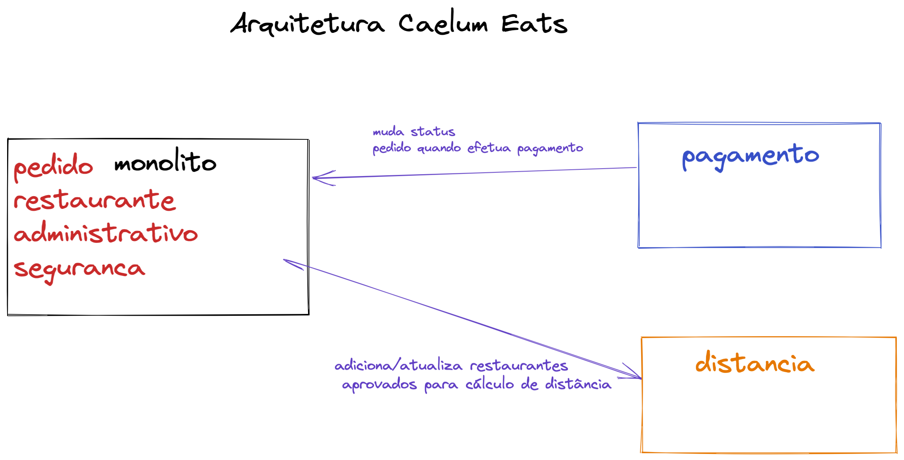

# todo item
- [x] Configurar org gihub
- [x] verificar os cursos Alura
- [x] Configurar os projetos week1
- [x] subir no github
- [ ] criar as tarefas da week1 
- [ ] gravar o video da week1 
- [ ] criar o trello da week1 
- [ ] Configurar os projetos week2
- [ ] criar as tarefas da week2  
- [ ] gravar o video da week2 
- [ ] criar o trello da week2

# Level Up Week 1 

# Objetivo do projeto

TBD

## Arquitetura inicial do projeto

